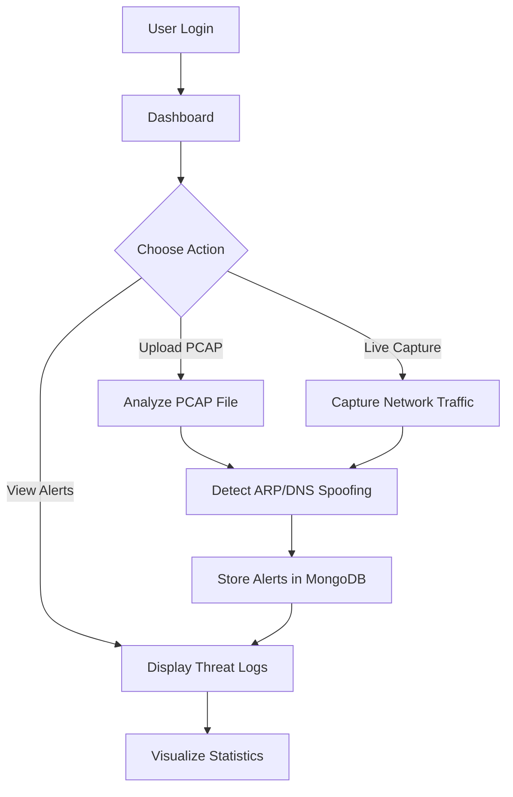
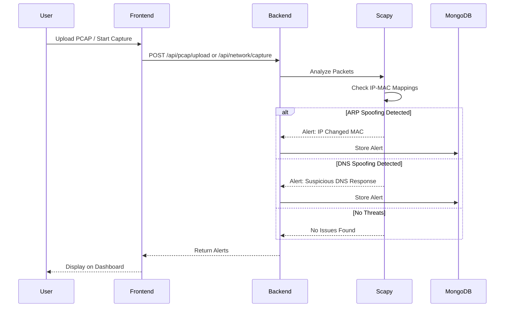
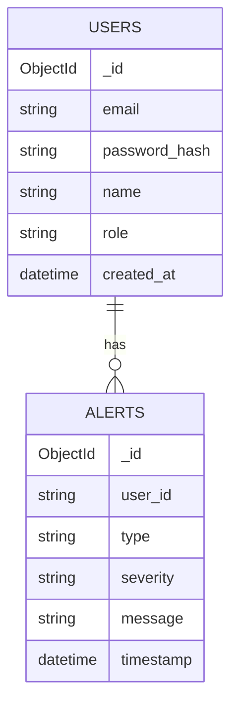
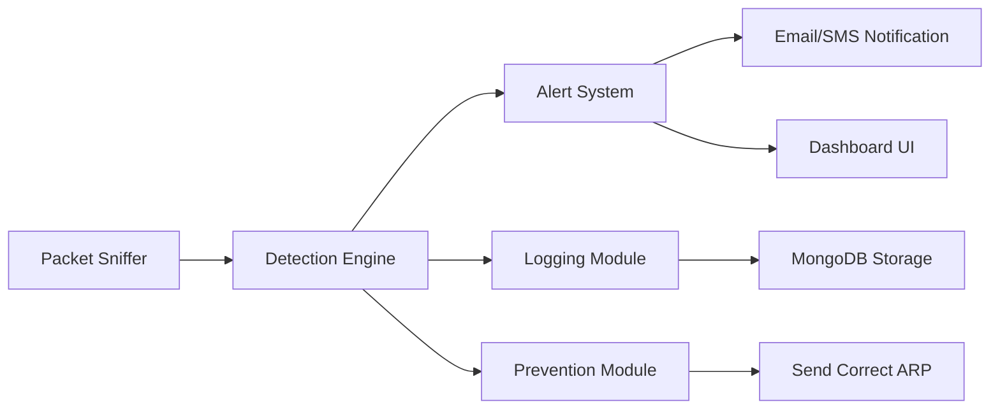

# ARP Guard - Network Security Monitoring Application

A real-time network security monitoring tool that detects ARP spoofing and DNS spoofing attacks using packet analysis.

## 🔐 Overview

**ARP Guard** is a comprehensive web-based network security monitoring application designed to detect and alert on **ARP spoofing** and **DNS spoofing attacks** within local networks. The application provides a modern dashboard interface for real-time threat monitoring, PCAP file analysis, and live network packet capture.

---

## 🚀 Features

- 🔐 **User Authentication**: Secure JWT-based authentication system
- 📊 **Real-time Dashboard**: Visual statistics and threat monitoring
- 🔍 **Threat Detection**: ARP and DNS spoofing detection
- 📁 **PCAP Analysis**: Upload and analyze network capture files
- 🎯 **Live Capture**: Real-time network packet monitoring
- 📈 **Visualizations**: Charts and graphs for threat distribution
- ⚠️ **Alert Management**: View and manage security alerts by severity
- 🧾 **Logging System**: Comprehensive threat logging with timestamps

---

## 🧱 Project Structure

```
arp-guard/
├── app/
│   ├── backend/
│   │   ├── server.py          # FastAPI application
│   │   ├── requirements.txt   # Python dependencies
│   │   └── .env              # Environment variables (not in git)
│   └── frontend/
│       ├── src/
│       │   ├── pages/         # React page components
│       │   ├── App.js         # Root component
│       │   └── index.jsx      # Entry point
│       ├── index.html         # HTML entry
│       ├── package.json       # Node dependencies
│       └── tailwind.config.js # Tailwind configuration
├── .env.example              # Environment template
├── .gitignore               # Git ignore rules
├── LICENSE                  # MIT License
├── README.md                # This file
├── start.bat                # Start script (Windows)
└── stop.bat                 # Stop script (Windows)
```

---

## 🛠️ Tech Stack

### Backend
- **FastAPI**: Modern Python web framework
- **MongoDB**: NoSQL database for storing alerts and users
- **Scapy**: Packet manipulation and analysis
- **JWT**: Secure authentication tokens
- **Motor**: Async MongoDB driver
- **Bcrypt**: Password hashing

### Frontend
- **React**: UI library (Parcel bundler)
- **Tailwind CSS**: Styling
- **Axios**: HTTP client
- **React Router**: Client-side routing
- **Lucide React**: Icons

---

## ⚙️ Prerequisites

- Python 3.8+
- MongoDB 4.0+
- Administrator/Root privileges (for packet capture)
- Windows/Linux/Mac OS

---

## 📥 Installation

### 1. Clone the Repository
```bash
git clone https://github.com/yourusername/arp-guard.git
cd arp-guard
```

### 2. Install Dependencies
```bash
# Backend
cd app/backend
pip install -r requirements.txt

# Frontend
cd ../frontend
npm install
```

### 3. Configure Environment Variables
```bash
# Copy the example environment file
copy .env.example app\backend\.env

# Edit app/backend/.env with your configuration
# Change SECRET_KEY and admin credentials
```

### 4. Start MongoDB
**Windows (as Administrator):**
```bash
net start MongoDB
```

**Linux/Mac:**
```bash
sudo systemctl start mongod
```

---

## ▶️ Running the Application

### Quick Start (Windows)

**Start the application:**
```bash
# Right-click and Run as Administrator
start.bat
```

**Stop the application:**
```bash
stop.bat
```

### Manual Start (All Platforms)

#### Start Backend Server
```bash
cd app/backend
python -m uvicorn server:app --reload --host 0.0.0.0 --port 8000
```

#### Start Frontend Server
```bash
cd app/frontend
npm install
npm start
```

### Access the Application
Open your browser and navigate to:
```
http://localhost:3000
```

**Default Login Credentials:**
- Email: `admin@example.com`
- Password: `admin123`

⚠️ **Important**: Change the default credentials after first login!

---

## 🧪 How It Works

### 🔄 Application Flow



### 🧠 Detection Workflow



### 🗂️ Database Schema



---

## 📊 Usage

### Dashboard Features
1. **Statistics Cards**: View total alerts and severity breakdown (Critical, High, Medium)
2. **Threat Distribution Chart**: Pie chart showing threat types (ARP Spoofing, DNS Spoofing, etc.)
3. **PCAP Upload**: Drag and drop or click to upload network capture files for analysis
4. **Live Capture**: Start real-time network monitoring (requires admin privileges)
5. **Threat Logs Table**: Detailed view of all detected threats with timestamp, type, severity, and message
6. **Alert Management**: Refresh alerts or clear all alerts with one click

### API Endpoints

#### Authentication
- `POST /api/auth/register` - Register new user
- `POST /api/auth/login` - User authentication
- `POST /api/auth/logout` - Logout user
- `GET /api/auth/me` - Get current user info

#### Alerts & Analysis
- `GET /api/alerts` - Retrieve user alerts
- `DELETE /api/alerts` - Clear all alerts
- `GET /api/stats` - Get dashboard statistics
- `POST /api/pcap/upload` - Upload PCAP file for analysis
- `POST /api/network/capture` - Start live packet capture

---

## 📌 Example Output

### Console Output
```
INFO:     Started server process
INFO:     Uvicorn running on http://0.0.0.0:8000
INFO:     Application startup complete.
```

### Alert Example
```json
{
  "type": "ARP Spoofing",
  "severity": "High",
  "message": "IP 192.168.1.1 changed MAC from aa:bb:cc:dd:ee:ff to 11:22:33:44:55:66",
  "timestamp": "2024-01-15T10:30:45.123Z"
}
```

---

## 🔒 Security Considerations

- Change default admin credentials immediately
- Use strong SECRET_KEY in production
- Run with appropriate network permissions
- Keep MongoDB secured and not exposed to public internet
- Use HTTPS in production environments
- Never commit `.env` file to version control

---

## 🐛 Troubleshooting

### MongoDB Connection Error
- Ensure MongoDB service is running
- Check MONGODB_URL in .env file
- Verify MongoDB is listening on port 27017

### Permission Denied for Packet Capture
- Run backend with administrator/root privileges
- On Linux: `sudo python -m uvicorn server:app`
- On Windows: Run terminal as Administrator

### Port Already in Use
- Change ports in startup commands:
  - Backend: `--port 8001`
  - Frontend: Edit `serve.py` to use different port

---

## 📈 Future Improvements

- 📧 Email/SMS alert notifications
- 🤖 Machine learning-based anomaly detection
- 🌐 Multi-network monitoring support
- 📱 Mobile application
- 🔄 Automatic attacker blocking
- 🔥 Integration with firewall rules
- 📊 Advanced analytics and reporting
- 🎨 Customizable alert thresholds

### 🚀 Advanced Architecture Idea



---

## 🤝 Contributing

Contributions are welcome! Please feel free to submit a Pull Request.

1. Fork the repository
2. Create a new branch (`git checkout -b feature/improvement`)
3. Commit your changes (`git commit -am 'Add new feature'`)
4. Push to the branch (`git push origin feature/improvement`)
5. Submit a pull request

---

## 📄 License

This project is licensed under the MIT License - see the [LICENSE](LICENSE) file for details.

---

## 👨‍💻 Author

Built for network security research and education purposes.

---

## ⭐ Acknowledgements

- Built for network security research and education
- Thesis project for academic purposes
- Inspiration from network security practices
- Open-source community for tools and libraries

---

## ⚠️ Disclaimer

This tool is for educational and authorized security testing purposes only. Unauthorized network monitoring may be illegal in your jurisdiction. Always obtain proper authorization before monitoring network traffic.
